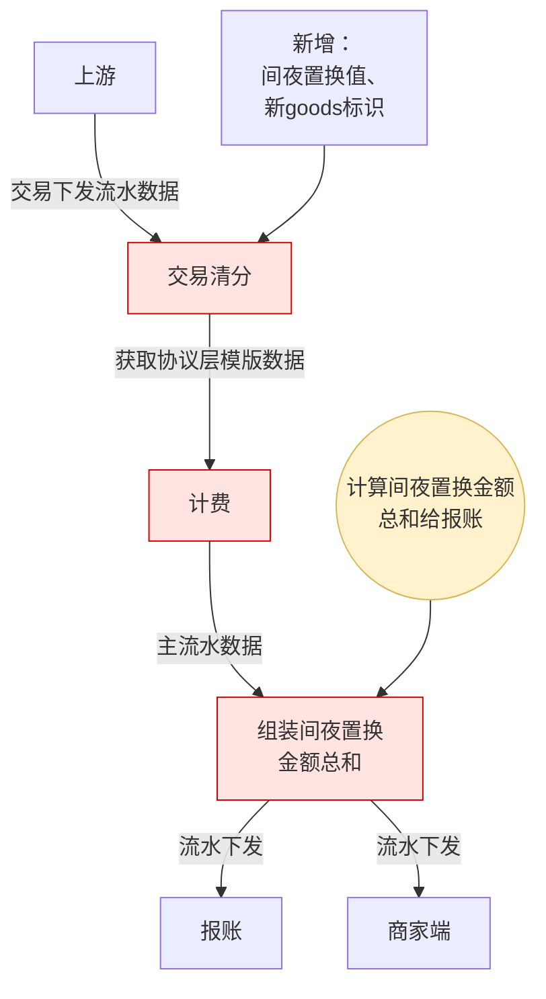

删除订单数据
```
http://dataprovider.nibmsc.test.sankuai.com/application/deleteClearDataByOrderId?orderId=4989997405302844227
```

补偿：
```
http://33.19.104.94:8080/compensate/single?commandId=1930105865935859715
```

补偿（带尾差）
```
http://10.109.211.79:8080/compensate/single/weiCha?commandId=1930807745352220753
```
